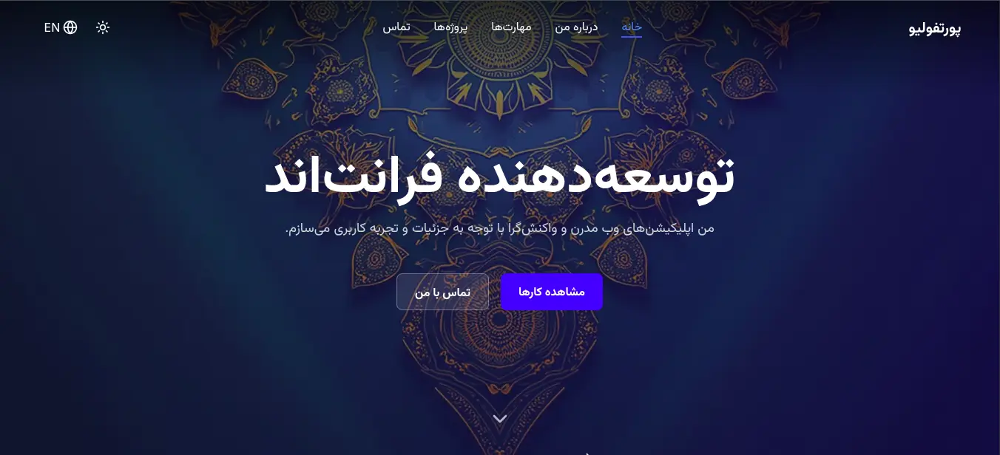

<a href="#-english-version">English</a> | <a href="#-persian-version">فارسی</a>

 

<b>🇬🇧 English Version</b>

 

<h1><b>Reza Shorche Personal Portfolio</b></h1>

A modern and fully responsive portfolio website built with React, Vite, and Tailwind CSS.

<a href="https://rshorche.vercel.app/" target="_blank">
<strong>🚀 View Live Demo</strong>
</a>

 

✨ Key Features
Design & User Experience
Fully Responsive Design: Flawless display on all devices, from mobile to desktop.

Dual Theme (Light/Dark Mode): With the user's choice saved in the browser's local storage.

Bilingual (Persian & English): Ability to switch languages across all sections of the site.

Functionality & Interactivity
Dynamic UI: Smooth entrance animations, attractive hover effects, and a continuous ticker for technologies.

Interactive Project Showcase: Features a professional photo slider (using Swiper.js) within a modal for project details.

Functional Contact Form: Connected to the EmailJS service to send messages directly to your email.

Code & Architecture
Clean, Component-Based Code: Built on modern React principles for maximum readability and maintainability.

Optimized Performance: Built with Vite for a fast and efficient development and user experience.

🔧 Tech Stack

🚀 Getting Started
To run this project locally, follow these steps:

1. Clone the repository:

git clone https://github.com/rshorche/rshorche
 
cd rshorche

2. Install dependencies:

npm install

3. Run the project:

npm run dev

You can now view the project at http://localhost:5173 (or another port shown in the terminal).

📬 Get in Touch

<b>🇮🇷 نسخه فارسی (Persian Version)</b>

 

<h1><b>پورتفولیو شخصی رضا شورچه</b></h1>

یک وب‌سایت پورتفولیو مدرن و کاملاً واکنش‌گرا که با React، Vite و Tailwind CSS ساخته شده است.

<a href="https://rshorche.vercel.app/" target="_blank">
<strong>🚀 مشاهده نسخه آنلاین</strong>
</a>

 

✨ ویژگی‌های کلیدی
طراحی و تجربه کاربری
طراحی کاملاً واکنش‌گرا (Responsive): نمایش بی‌نقص در تمام دستگاه‌ها، از موبایل تا دسکتاپ.

دو تم روشن و تاریک (Light/Dark Mode): با قابلیت ذخیره انتخاب کاربر در حافظه مرورگر.

دو زبانه (فارسی و انگلیسی): قابلیت تغییر زبان در تمام بخش‌های سایت.

عملکرد و تعامل
رابط کاربری پویا: انیمیشن‌های ورود نرم، افکت‌های هاور جذاب و نوار متحرک تکنولوژی‌ها.

نمایش تعاملی پروژه‌ها: با اسلایدر عکس حرفه‌ای (Swiper.js) در یک پاپ‌آپ برای نمایش جزئیات.

فرم تماس کاربردی: متصل به سرویس EmailJS برای ارسال مستقیم پیام‌ها به ایمیل شما.

کد و معماری
کدنویسی تمیز و کامپوننت‌محور: بر پایه اصول مدرن React برای حداکثر خوانایی و قابلیت نگهداری.

عملکرد بهینه: ساخته شده با Vite برای تجربه توسعه و کاربری سریع و بهینه.

🔧 تکنولوژی‌های استفاده شده

🚀 راه‌اندازی و اجرا
برای اجرای این پروژه به صورت محلی (Local)، مراحل زیر را دنبال کنید:

۱. کلون کردن ریپازیتوری:

git clone https://github.com/rshorche/rshorche
 
cd rshorche

۲. نصب وابستگی‌ها:

npm install

۳. اجرای پروژه:

npm run dev

حالا می‌توانید پروژه را در آدرس http://localhost:5173 (یا پورت دیگری که در ترمینال نمایش داده می‌شود) مشاهده کنید.

📬 ارتباط با من

